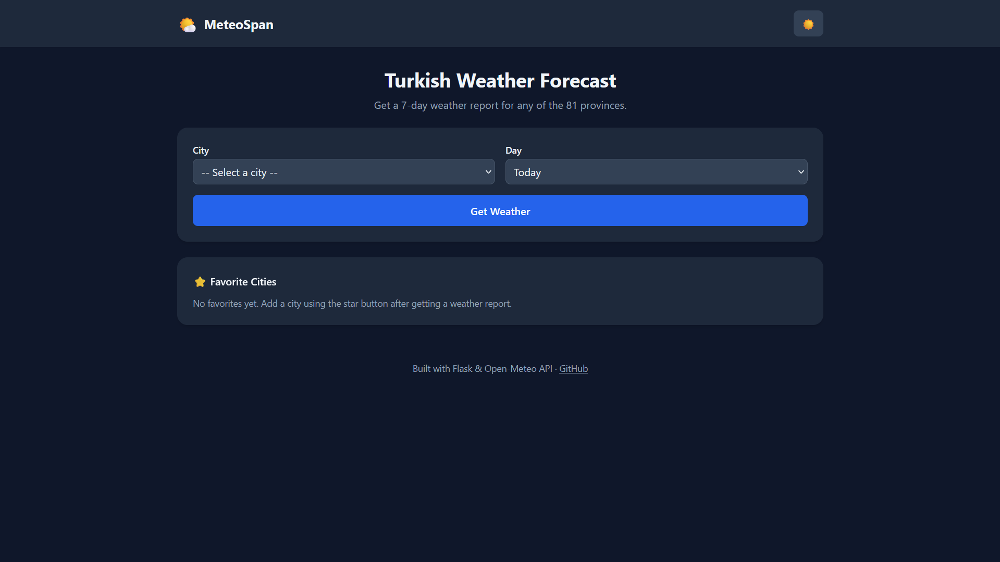
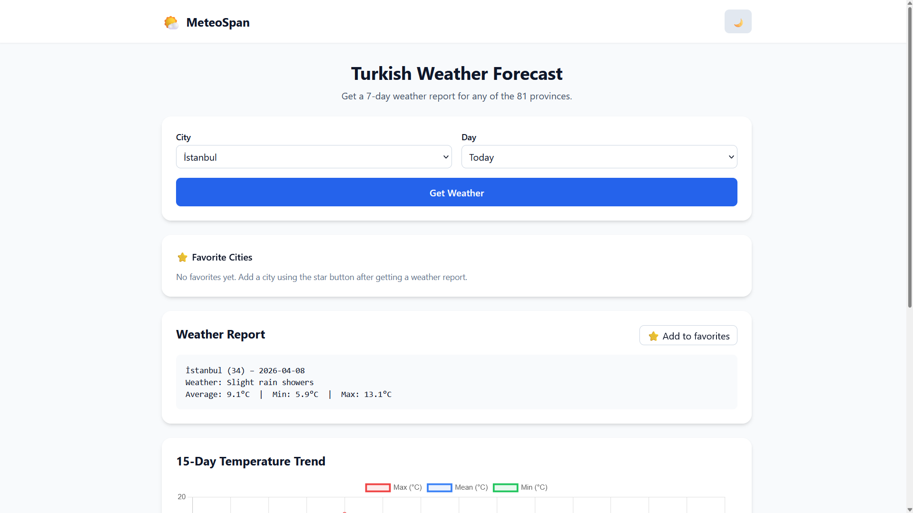
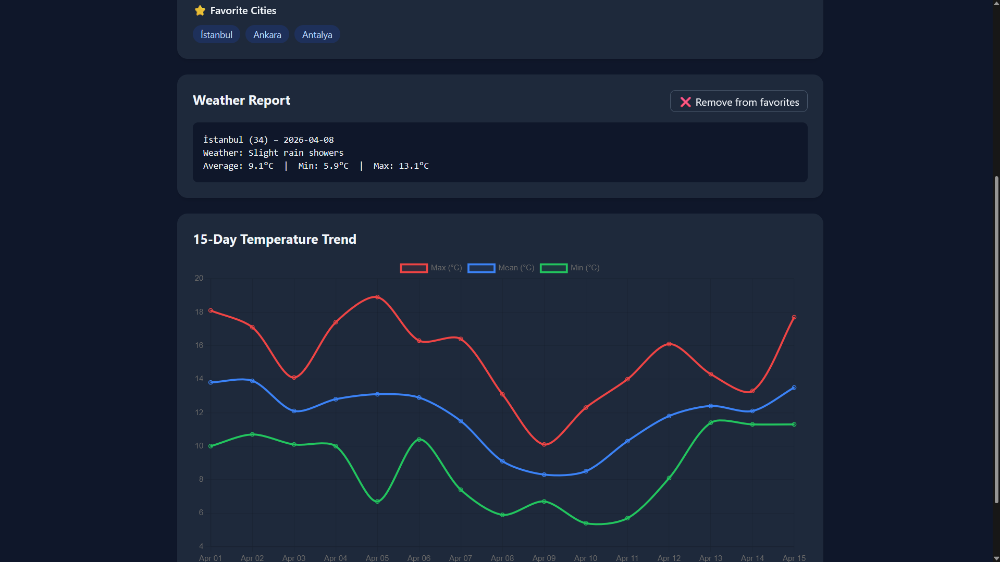
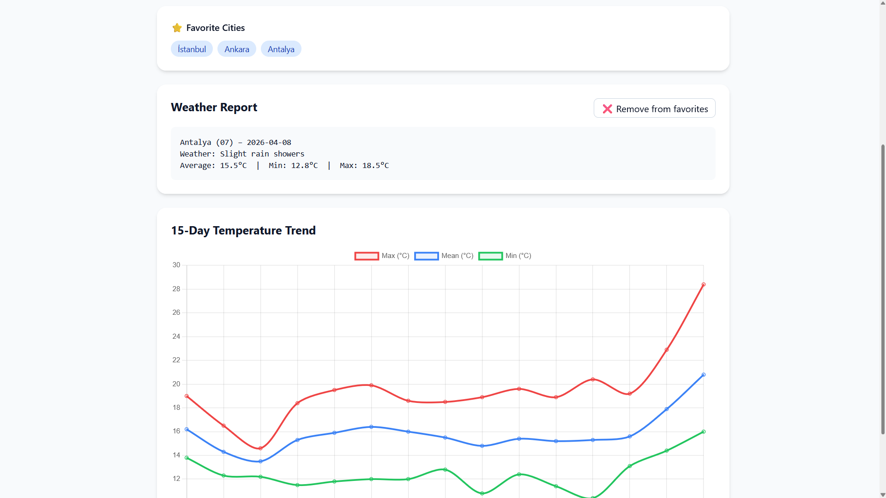

# 🌤️ MeteoSpan

A modern web application that provides 7-day weather forecasts and historical data for all 81 provinces of Türkiye, with an interactive temperature chart, favorites, and dark mode.

Built with **Flask**, **Tailwind CSS**, **Chart.js**, and the **Open-Meteo API**.

> 🌐 **Live demo:** https://meteo-span.onrender.com

---

## 📸 Screenshots








---

## ✨ Features

- 🏙️ **All 81 Turkish provinces** — select any city from a dropdown
- 📅 **Past and future weather** — from 7 days ago up to 7 days in the future
- 📊 **Interactive temperature chart** — 15-day trend showing max, mean, and min temperatures
- ⭐ **Favorite cities** — save your most-used cities for quick access (stored in your browser)
- 🌙 **Dark mode** — with automatic preference saving
- 📱 **Responsive design** — works on mobile, tablet, and desktop
- ⚡ **Fast** — in-memory caching avoids hitting the API on every request
- 🔒 **No API keys required** — uses the free Open-Meteo API

---

## 🧰 Tech Stack

| Component | Purpose |
|---|---|
| **Python 3.9+** | Backend language |
| **Flask** | Web framework |
| **pandas** | Data processing |
| **Open-Meteo API** | Weather data source |
| **requests-cache** | HTTP-level caching |
| **Tailwind CSS** | Styling (via CDN) |
| **Chart.js** | Temperature chart (via CDN) |
| **Jinja2** | Templating (comes with Flask) |

---

## 📁 Project Structure

```text
MeteoSpan/
├── app.py              # Flask application and routes
├── api_client.py       # Open-Meteo API client and in-memory cache
├── utils.py            # City/date lookup and report formatting
├── weather_codes.py    # WMO weather code to description mapping
├── test_cache.py       # Standalone test script for the cache layer
├── requirements.txt    # Python dependencies
├── templates/
│   ├── base.html       # Shared layout: header, footer, dark mode
│   └── index.html      # Main page: form, results, chart, favorites
├── .gitignore
├── LICENSE
└── README.md
```

### What each file does

- **`app.py`** — Entry point. Defines a single route (`/`) that handles both initial page loads (GET) and form submissions (POST). Builds the chart data for the frontend.
- **`api_client.py`** — Fetches weather data for all 81 provinces from the Open-Meteo API in a single batch request. Includes a two-layer cache: HTTP-level (via `requests-cache`) and in-memory (via module-level variables with a 1-hour expiration).
- **`utils.py`** — Takes a city name (or plate code) and a day offset (`+3`, `-1`, `0`, etc.) and returns either the raw row or a formatted human-readable report. Uses date-based lookup to avoid off-by-one errors.
- **`weather_codes.py`** — A simple dictionary mapping WMO weather interpretation codes to English descriptions (e.g., `0` → "Clear sky", `95` → "Thunderstorm").
- **`templates/base.html`** — The shared layout used by every page: header with the dark mode toggle, footer, Tailwind CSS setup, and the flicker-free dark mode preloader.
- **`templates/index.html`** — Extends `base.html` and fills in the main content: form, error messages, weather report, Chart.js temperature graph, and the favorites management script.

---

## 🚀 Running Locally

### Prerequisites

- Python 3.9 or higher
- Git

### 1. Clone the repository

```bash
git clone https://github.com/keremcdm/MeteoSpan.git
cd MeteoSpan
```

### 2. Create and activate a virtual environment

**Windows (PowerShell):**
```bash
python -m venv .venv
.venv\Scripts\activate
```

**macOS / Linux:**
```bash
python -m venv .venv
source .venv/bin/activate
```

### 3. Install dependencies

```bash
pip install -r requirements.txt
```

### 4. Run the app

```bash
python app.py
```

The app will be available at **http://127.0.0.1:5000**.

---

## 🧪 Testing the Cache Layer

A standalone script is included to verify that the in-memory cache is working correctly:

```bash
python test_cache.py
```

This script calls `fetch_weather_data()` twice and measures the time difference. The first call fetches from the API (a few hundred milliseconds to a few seconds, depending on whether the HTTP cache is warm). The second call should return in microseconds from the in-memory cache.

---

## 🏗️ How It Works

### Data flow

1. The user visits the site → Flask serves `index.html` with a city dropdown.
2. The user picks a city and day, then submits the form.
3. Flask calls `get_city_day_report(city, day_offset)` from `utils.py`.
4. `utils.py` calls `fetch_weather_data()` from `api_client.py`.
5. If the cache is fresh (< 1 hour old), the cached DataFrame is returned instantly.
6. Otherwise, `api_client.py` makes a single batched request to Open-Meteo for all 81 cities, processes the response into a pandas DataFrame, caches it, and returns it.
7. `utils.py` filters the DataFrame by city and target date, then formats the result into a human-readable report.
8. Flask also calls `build_chart_data()` to prepare a 15-day temperature window for the Chart.js graph.
9. Both the report and the chart data are passed to `index.html`, which renders them on the same page.

### Caching strategy

MeteoSpan uses **two layers of caching** to keep the app fast and avoid unnecessary API calls:

- **HTTP cache** (via `requests-cache`): caches the raw HTTP response from Open-Meteo for 1 hour. This persists to disk as `.cache.sqlite`, so even if the Python process restarts, the data is available.
- **In-memory cache** (custom): caches the processed pandas DataFrame in a module-level variable for 1 hour. This skips both the API call *and* the pandas processing on subsequent requests, making cached responses return in microseconds.

### Date handling

All dates are computed and compared in **UTC** to match the timezone the API returns. Lookups are done by date (not by position in the DataFrame) to avoid off-by-one errors from the way Open-Meteo splits past and forecast days.

### Favorites

Favorite cities are stored in the browser's `localStorage`, not on the server. This means:
- No database is needed
- No login is required
- Favorites persist across browser sessions for each user individually
- Favorites are private to each browser

---

## 🎓 What I Learned

Building this project taught me a lot about turning a small CLI tool into a real web application:

- **Flask fundamentals**: routing, handling GET and POST requests in the same view, template rendering, form submission, and error handling with try/except.
- **Jinja2 templating**: template inheritance with `` and ``, variable interpolation, control flow (``, ``), and safely passing Python data to JavaScript with the `|tojson` filter.
- **Caching design**: the trade-offs between HTTP-level caching and application-level caching, and why combining both gives the best user experience.
- **Date and timezone pitfalls**: the importance of comparing dates at the right granularity (date-only, not datetime-with-timezone) to avoid subtle off-by-one bugs.
- **Refactoring a codebase**: migrating from a CSV-on-disk architecture to an in-memory architecture without breaking existing callers, and the concept of "refactoring debt" — when a change in one place reveals something that needs updating elsewhere.
- **Responsive design with Tailwind CSS**: utility-first styling, responsive breakpoints (`md:`, `lg:`), and dark mode via a `dark:` variant and a class on the root element.
- **A bit of JavaScript**: reading and writing to `localStorage`, event listeners, DOM manipulation, and rendering a Chart.js chart from Python-generated data.
- **Git workflow**: committing focused changes with meaningful messages, understanding the staging area, and using `.gitignore` to keep build artifacts out of version control.

---

## 📄 License

This project is licensed under the MIT License — see the [LICENSE](LICENSE) file for details.

---

## 🙏 Acknowledgements

- **[Open-Meteo](https://open-meteo.com/)** for the free, high-quality weather API with no authentication required.
- **[Tailwind CSS](https://tailwindcss.com/)** for making responsive design and dark mode so approachable.
- **[Chart.js](https://www.chartjs.org/)** for the elegant chart rendering.

---

## 👤 Author

**Kerem Çidem** 
| Computer Engineering Student at Politecnico di Torino

[](https://github.com/keremcdm)
[](https://www.linkedin.com/in/keremcidem/)